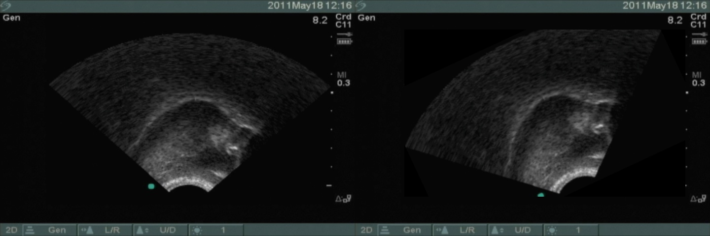

#Imaging.py

__NOTE__: _This script depends on_ `numpy` _and_ `OpenCV` _with python bindings (_`cv2`_)_  

##Running the script
`python imaging.py`  

A REPL will start:  

```
Enter an angle (positive or negative)

    COMMANDS:
      q OR exit => quit
      help OR ? => help

  ?> 25
```

The output should look something like this:  

<a href="url"></a>
