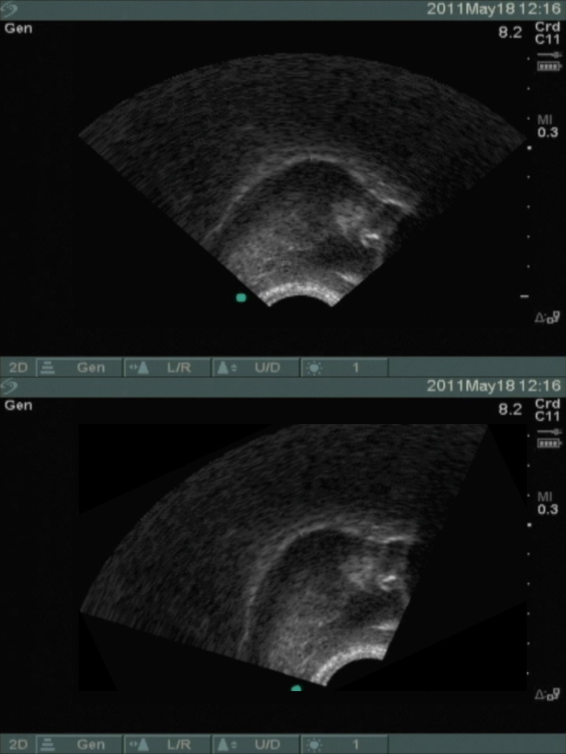
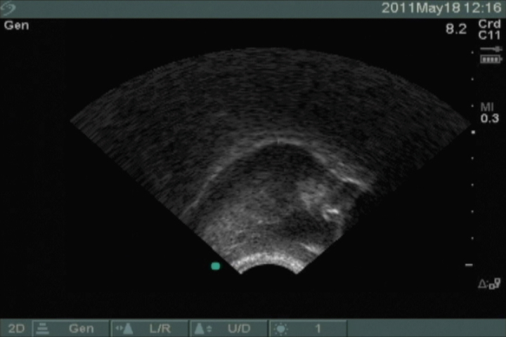
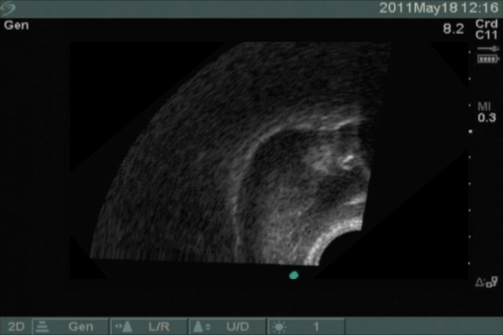
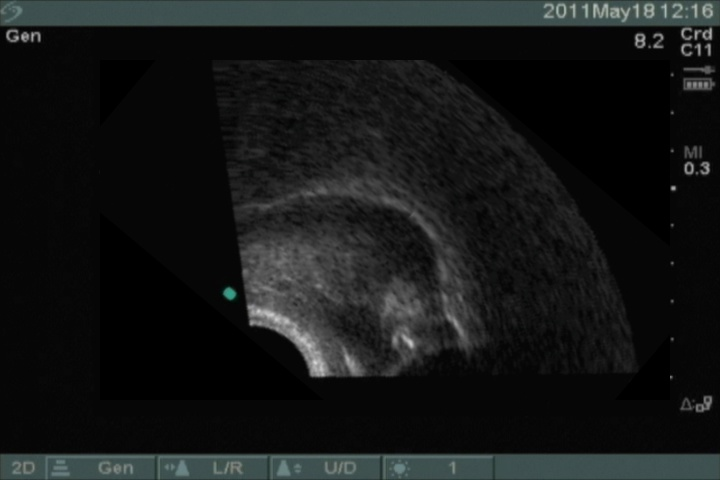
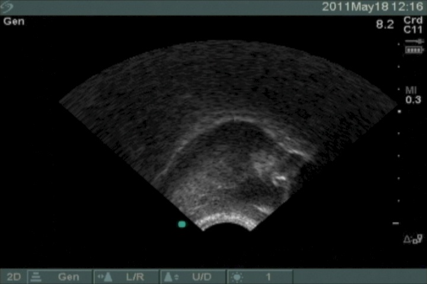
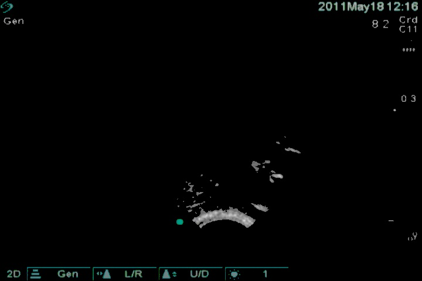

#Imaging.py

__NOTE__: _This script depends on_ `numpy` _and_ `OpenCV` _with python bindings (_`cv2`_)_  

## Guide  
  - [Using the `imaging` REPL to preview rotations](#repl)
  - [Exploring the `RichImage` class](#richimage)
    - [Saving an image](#saving)
    - [Displaying an image](#display)
    - [Rotating the ultrasound fan](#rotatefan)
    - [Thresholding an image](#thresholding)

---

## <a name="repl"></a>Running the script

```bash
python imaging.py
```  

A REPL will start:  

```
COMMANDS:
  q OR exit	=> quit
  ? OR help	=> help
  s OR save	=> save
  horizontal	=> change to horizontal view (default)
  v OR vertical	=> change to vertical view

  ?> 25
```

The output should look something like this:  

<a href="url"></a>

You can also get a "stacked" comparison by specifying the vertical view:

```
?> v
?> 25
```

<a href="url"></a>

---

## <a name="richimage"></a>Using the `RichImage` class

Let's explore the RichImage class

```python
from imaging import RichImage

test = RichImage('test.jpg')
```

### <a name="display"></a>Displaying images
```python
test.show()
```
<a href="url"></a>


### <a name="rotatefan"></a>Rotating the ultrasound fan

The location of the fan grid has been estimated for the SonoSite Titan.  In a future release, we hope to detect the fan grid "automagically" from its shape.

Let's rotate the ultrasound fan 40 degrees:

```python
rotated = test.rotate_fan(40)
```
<a href="url"></a>

We can also rotate in the other direction by using a negative value:

```python
rotated = test.rotate_fan(-40)
```
<a href="url"></a>


### <a name="threshold"></a>Thresholding a `RichImage`

The RichImage class has a simple api for thresholding an image.

In the next snippet, pixels &le; 10 will be set to 0 (black):

```python
thresholded = test.default_threshold()
thresholded.show()
```
<a href="url"></a>

You can of course experiment with a different threshold.
Let's set any pixel &le; 100 to 0 (black):

```python
thresholded = test.set_to(lessthan=100, new_value=0)
thresholded.show()
```
<a href="url"></a>

### <a name="saving"></a>Saving an image

```python
rotated.save("desired/path/for/image.jpg")
```
